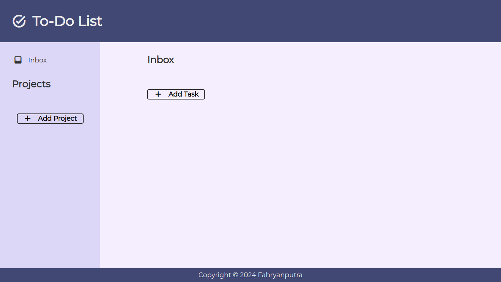

# Todo List App

This Simple Todo List App is a straightforward and user-friendly application designed to help users organize their tasks efficiently. The project features a clean and intuitive user interface, allowing users to easily add, edit, and delete tasks. Each task can be assigned a priority level or due date, enabling users to prioritize and manage their workload effectively.

## Demo

[Link to live demo](https://fahryanputra.github.io/todo-list-app/)

## Built With

- HTML
- CSS
- Javascript
- Webpack
## Authors

- Github: [@fahryanputra](https://www.github.com/fahryanputra)
- Email: [fahryandi.herlasmara@gmail.com](fahryandi.herlasmara@gmail.com)

## Acknowledgements

 - [Todoist](https://todoist.com/)
 - [Google Font](https://fonts.google.com/)
